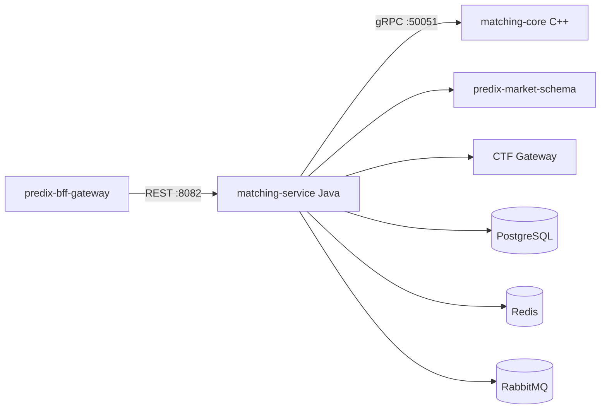

# PrediX Matching Core — Architecture

## Overview

`predix-matching-core` replaces the archived `predix-matching-engine` with a hybrid architecture: a C++ hot-path matching kernel and a Java orchestration service that preserves the external REST/MQ/DB contract for zero BFF changes.

## Components

## Layering

| Layer | Module | Responsibility |
|-------|--------|----------------|
| Hot path | `core/` | In-memory order books, price-time FIFO matching, WAL, sharded single-thread execution |
| Orchestration | `service/` | REST API, validation, persistence, idempotency, MQ events, execution tasks |
| Integration | `service/client/` | market-schema, CTF gateway, gRPC matching core |

## Place order flow

1. BFF → `POST /api/v1/orders`
2. Validate request; check market OPEN via market-schema
3. Idempotency (`user_id` + `client_order_id`)
4. Persist order (NEW); emit `ORDER_CREATED`
5. gRPC `SubmitOrder` → C++ core matches
6. Persist trades; update maker orders; emit `ORDER_MATCHED`, `TRADE_EXECUTED`
7. Create execution tasks → RabbitMQ `execution.task`
8. Return unified `ApiResponse`

## Warmup

On startup, `OrderBookWarmup` loads NEW/PARTIAL orders from PostgreSQL and calls gRPC `WarmupBook` per `(marketId, outcomeId)`.

## Boundaries

- **Does not** touch BACP custody or oracle/UMA resolution
- **Does not** modify archived `predix-matching-engine`
