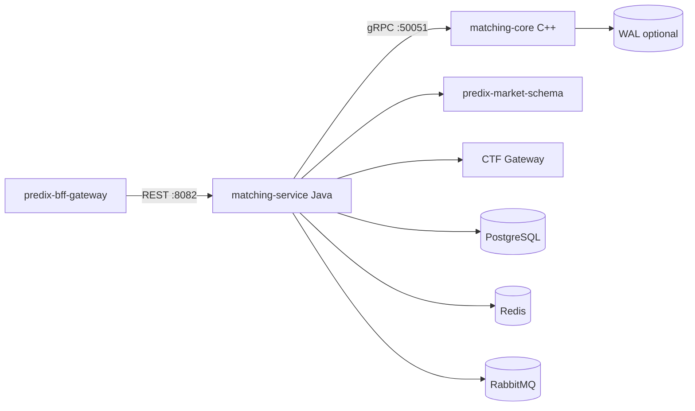
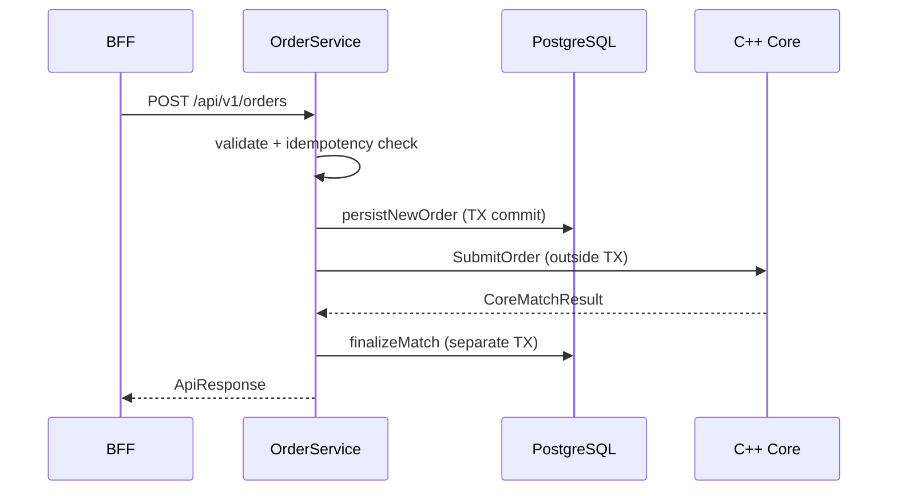

# PrediX Matching Core — Architecture

> See also: [Matching rules](matching-rules.md) · [BFF integration](integration.md) · [Java compat mapping](java-compat-mapping.md)

## Overview

`predix-matching-core` replaces the archived `predix-matching-engine` with a hybrid architecture: a C++ hot-path matching kernel and a Java orchestration service that preserves the external REST/MQ/DB contract for zero BFF changes.

**Matching runs only in C++.** Java does not maintain a production in-memory order book.

## Components

## Layering

| Layer | Module | Responsibility |
|-------|--------|----------------|
| Hot path | `core/` | In-memory order books, price-time FIFO matching, WAL append/replay, sharded execution, gRPC server (TLS optional) |
| Orchestration | `service/` | REST API, validation, persistence, idempotency, MQ events, execution tasks, reconciliation, ops admin API |
| Integration | `service/client/` | market-schema, CTF gateway, gRPC matching core |

## MatchingCoreClient modes

| Condition | Implementation | Behavior |
|-----------|----------------|----------|
| `grpc.enabled=true` | `GrpcMatchingCoreClient` | Production path — all match/cancel/depth via C++ |
| `grpc.enabled=false`, profile `h2` or `test` | `InMemoryMatchingCoreClient` (test) | In-process stub for unit/H2 and Testcontainers integration tests |
| `grpc.enabled=false`, other profiles | `UnavailableMatchingCoreClient` | Fail-fast `503 MATCHING_CORE_UNAVAILABLE` |

gRPC failures do **not** fall back to Java matching.

## Place order flow

The place/cancel path deliberately splits DB transactions from gRPC so a successful match in C++ is not rolled back when PostgreSQL persistence fails.

Steps:

1. BFF → `POST /api/v1/orders`
2. Validate request; check market OPEN via market-schema
3. Idempotency (`user_id` + `client_order_id`) — return cached response if present
4. **TX 1:** Persist order (`NEW`); emit `ORDER_CREATED`
5. **Outside TX:** gRPC `SubmitOrder` → C++ core matches (idempotent on `orderId` retry)
6. **TX 2:** Persist trades; update taker/maker orders; save idempotency response; emit `ORDER_MATCHED`, `TRADE_EXECUTED`
7. Create execution tasks → RabbitMQ `execution.task`
8. Return unified `ApiResponse`

If step 6 fails after step 5 succeeds, the order is marked `PENDING_MATCH` and a background worker retries finalize (see below).

### Cancel order flow

1. **TX 1:** Lock order; validate cancel eligibility
2. **Outside TX:** gRPC `CancelOrder`
3. **TX 2:** Set status `CANCELLED`; emit events; create cancel execution task

## Consistency & recovery

| Mechanism | Component | Purpose |
|-----------|-----------|---------|
| **Split transactions** | `OrderService` + `OrderMatchPersistenceService` | gRPC outside `@Transactional` — C++ match survives DB finalize failure |
| **Startup warmup** | `OrderBookWarmup` | Load `NEW` / `PARTIAL` / `PENDING_MATCH` orders from PostgreSQL into C++ via `WarmupBook(replaceExisting=true)` |
| **Submit idempotency** | C++ `submission_cache_` | Duplicate `SubmitOrder` for same `orderId` returns cached result |
| **Client idempotency** | `IdempotencyService` | Duplicate `clientOrderId` returns cached HTTP response (upsert-safe) |
| **Fail-fast gRPC** | `GrpcMatchingCoreClient` | Core unavailable → `503`, no silent Java fallback |
| **`PENDING_MATCH` worker** | `PendingMatchRecoveryService` + `PendingMatchScheduler` | Retry DB finalize after gRPC success + persist failure |
| **Health monitor** | `MatchingCoreHealthMonitor` | After C++ recovery, trigger full DB warmup |
| **Depth reconciliation** | `OrderBookReconciliationService` + scheduler | Compare DB-aggregated depth vs C++ `GetDepth`; repair drift via warmup |
| **Drift metrics** | `OrderBookReconciliationMetrics` | Prometheus counters `predix.orderbook.drift.detected` / `.repaired` |
| **Admin reload** | `AdminOrderBookController` | Operator-triggered full or per-book reload (`ResetBook` + DB warmup) |
| **WAL replay (optional)** | `WalReader` in C++ | Replay `SUBMIT`/`CANCEL` records on startup before gRPC accepts traffic |

PostgreSQL is the source of truth for order state; C++ in-memory books are rebuilt from DB on warmup (WAL replay is an optional fast-path supplement).

## Warmup

On startup (when gRPC is enabled), `OrderBookWarmup` loads open orders from PostgreSQL and calls gRPC `WarmupBook` per `(marketId, outcomeId)` with `replaceExisting=true` (clear book, then reload).

The same warmup path is used by:

- `MatchingCoreHealthMonitor` after C++ recovery
- `OrderBookReconciliationService` when depth drift is detected
- `AdminOrderBookController` for manual operator reload

## Order book queries

| Endpoint | Source |
|----------|--------|
| `GET /api/v1/orderbooks/{marketId}/{outcomeId}` | Book metadata from PostgreSQL + top 10 depth levels from C++ |
| `GET /api/v1/orderbooks/{marketId}/{outcomeId}/depth` | Depth only from C++ (`levels` query param, default 10) |

## Admin operations

Enabled via `predix.admin.enabled=true`. All `/api/v1/admin/**` routes require header `X-Admin-Api-Key`.

| Endpoint | Action |
|----------|--------|
| `POST /api/v1/admin/orderbooks/reload` | Full DB warmup of all open books |
| `POST /api/v1/admin/orderbooks/{marketId}/{outcomeId}/reload` | `ResetBook` + single-book DB warmup |

Not exposed to BFF — intended for ops / internal tooling only.

## gRPC transport security

| Side | Default | Production option |
|------|---------|-------------------|
| Java client | Plaintext (`NettyChannelBuilder.usePlaintext()`) | `tls-enabled=true` + `trust-cert-path` |
| C++ server | `InsecureServerCredentials` | `tls_cert_path` + `tls_key_path` in `core/config/core.yaml` |

## C++ WAL

Append-only line log written on successful submit/cancel (`SUBMIT|…`, `CANCEL|…`). Configured in `core/config/core.yaml`:

| Key | Purpose |
|-----|---------|
| `wal_path` | File location (Docker volume `/var/lib/predix`) |
| `wal_flush_each_append` | Per-line fsync (durable, slower) |
| `wal_replay_on_startup` | Replay records into empty books before gRPC listen |

Warmup/reload operations do not append to WAL — DB remains the authoritative rebuild source.

## Schedulers (non-H2 profiles)

| Scheduler | Interval (default) | Role |
|-----------|-------------------|------|
| `MatchingCoreHealthMonitor` | 30 s | Probe C++ `Health`; full warmup on recovery |
| `OrderBookReconciliationScheduler` | 5 min | Detect/repair DB vs C++ depth drift |
| `PendingMatchScheduler` | 60 s | Retry `PENDING_MATCH` orders |
| `RetryScheduler` | 30 s | Retry failed CTF execution tasks |

## CI

GitHub Actions (`.github/workflows/ci.yml`):

- **cpp** — cmake build + ctest (9 tests)
- **java** — `mvn test` (37 unit tests)
- **java-integration** — `mvn test -Pintegration` with Testcontainers (Docker)

## Boundaries

- **Does not** touch BACP custody or oracle/UMA resolution
- **Does not** modify archived `predix-matching-engine`

## Related docs

- [Matching rules](matching-rules.md) — price-time priority, status machine
- [BFF integration](integration.md) — REST contract, env vars, smoke tests
- [Java compat mapping](java-compat-mapping.md) — migration from archived engine
