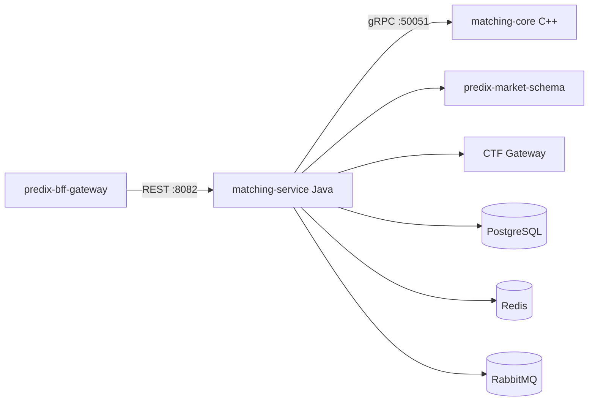

# PrediX Matching Core — Architecture

## Overview

`predix-matching-core` replaces the archived `predix-matching-engine` with a hybrid architecture: a C++ hot-path matching kernel and a Java orchestration service that preserves the external REST/MQ/DB contract for zero BFF changes.

**Matching runs only in C++.** Java does not maintain a production in-memory order book.

## Components

## Layering

| Layer | Module | Responsibility |
|-------|--------|----------------|
| Hot path | `core/` | In-memory order books, price-time FIFO matching, WAL, sharded single-thread execution |
| Orchestration | `service/` | REST API, validation, persistence, idempotency, MQ events, execution tasks |
| Integration | `service/client/` | market-schema, CTF gateway, gRPC matching core |

## MatchingCoreClient modes

| Condition | Implementation | Behavior |
|-----------|----------------|----------|
| `grpc.enabled=true` | `GrpcMatchingCoreClient` | Production path — all match/cancel/depth via C++ |
| `grpc.enabled=false`, profile `h2` | `InMemoryMatchingCoreClient` (test) | In-process stub for unit/H2 tests only |
| `grpc.enabled=false`, other profiles | `UnavailableMatchingCoreClient` | Fail-fast `503 MATCHING_CORE_UNAVAILABLE` |

gRPC failures do **not** fall back to Java matching.

## Place order flow

1. BFF → `POST /api/v1/orders`
2. Validate request; check market OPEN via market-schema
3. Idempotency (`user_id` + `client_order_id`)
4. Persist order (NEW); emit `ORDER_CREATED`
5. gRPC `SubmitOrder` → C++ core matches (idempotent on `orderId` retry)
6. Persist trades; update maker orders; emit `ORDER_MATCHED`, `TRADE_EXECUTED`
7. Create execution tasks → RabbitMQ `execution.task`
8. Return unified `ApiResponse`

## Consistency & recovery

| Mechanism | Component | Purpose |
|-----------|-----------|---------|
| **Startup warmup** | `OrderBookWarmup` | Load `NEW`/`PARTIAL` orders from PostgreSQL into C++ via `WarmupBook(replaceExisting=true)` |
| **Submit idempotency** | C++ `submission_cache_` | Duplicate `SubmitOrder` for same `orderId` returns cached result |
| **Fail-fast gRPC** | `GrpcMatchingCoreClient` | Core unavailable → `503`, no silent Java fallback |
| **Health monitor** | `MatchingCoreHealthMonitor` | After C++ recovery, trigger full DB warmup |
| **Depth reconciliation** | `OrderBookReconciliationService` | Compare DB-aggregated depth vs C++ `GetDepth`; repair drift via warmup |

PostgreSQL is the source of truth for order state; C++ in-memory books are rebuilt from DB on warmup.

## Warmup

On startup (when gRPC is enabled), `OrderBookWarmup` loads NEW/PARTIAL orders from PostgreSQL and calls gRPC `WarmupBook` per `(marketId, outcomeId)` with `replaceExisting=true` (clear book, then reload).

## Boundaries

- **Does not** touch BACP custody or oracle/UMA resolution
- **Does not** modify archived `predix-matching-engine`
